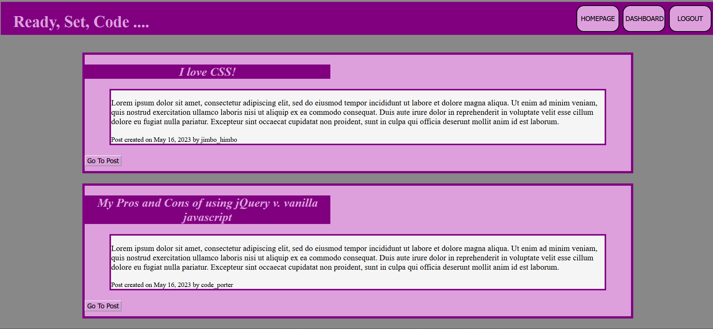

# Coding Spree

## DESCRIPTION 

Week 14 Challenge for Full-Stack Programming bootcamp at the University of Washington in partnership with edX. This is a full-stack application that utilizes handlebars to create a front end design and sequelize to create the database. The project is a blogpage that users can create accounts to talk about anything tech! 

[DEMO](https://www.loom.com/share/291ec7c84a6340d8849d9da4b94ef77f)

---

## TABLE OF CONTENTS 

[Description](#description)

[Installation](#installation)

[Usage](#usage)

[Contributions](#contributions)

[Testing](#testing)

[License](#license) 

[Questions](#questions)

---

## INSTALLATION 

This project runs using node and SQL. Follow the necessary installation for these programs to download them to your local device. 

After entering the mySQL terminal enter the code "SOURCE db/schema.sql" to create the user_db. 

Then, in the normal terminal, run the code "npm i" into node to install the necessary dependencies.

After that, run the code "node seeds/seed.js" into node to seed the user_db.

Finally run the code "npm start" to begin the application server and view it within your preferred browser at localhost:3001/

---

## USAGE

This program runs a server on your local device and the webpage is meant to be viewed at localhost:3001/ in whichever browser you already use. 

At the root directory, the user will see all posts including their title, content, and the user and date posted. The user can click on a button to view the post.

However, at this point the user will be directed to log in or sign up to view any of the other pages. 

The user can enter their email and password to login or they can sign up by providing a username, email and password.

Once signed in the user is taken to their dash which will display their posts. They can delete their posts, edit them, or view them. Additionally, users can create a post at this page. 

Finally, when viewing a post, users can comment their opinions under it!

---

## CONTRIBUTIONS

N/A

---

## TESTING

N/A

---

## LICENSE 

MIT License
      Copyright (c) 2023 tykervella
      
      Permission is hereby granted, free of charge, to any person obtaining a copy
      of this software and associated documentation files (the "Software"), to deal
      in the Software without restriction, including without limitation the rights
      to use, copy, modify, merge, publish, distribute, sublicense, and/or sell
      copies of the Software, and to permit persons to whom the Software is
      furnished to do so, subject to the following conditions:
      
      The above copyright notice and this permission notice shall be included in all
      copies or substantial portions of the Software.
      
      THE SOFTWARE IS PROVIDED "AS IS", WITHOUT WARRANTY OF ANY KIND, EXPRESS OR
      IMPLIED, INCLUDING BUT NOT LIMITED TO THE WARRANTIES OF MERCHANTABILITY,
      FITNESS FOR A PARTICULAR PURPOSE AND NONINFRINGEMENT. IN NO EVENT SHALL THE
      AUTHORS OR COPYRIGHT HOLDERS BE LIABLE FOR ANY CLAIM, DAMAGES OR OTHER
      LIABILITY, WHETHER IN AN ACTION OF CONTRACT, TORT OR OTHERWISE, ARISING FROM,
      OUT OF OR IN CONNECTION WITH THE SOFTWARE OR THE USE OR OTHER DEALINGS IN THE
      SOFTWARE.
   

--- 

## QUESTIONS

Any Questions regarding this project can be directed to me personally. You can find me at [github](https://github.com/tykervella) or send me an email at tylerkervella@gmail.com.